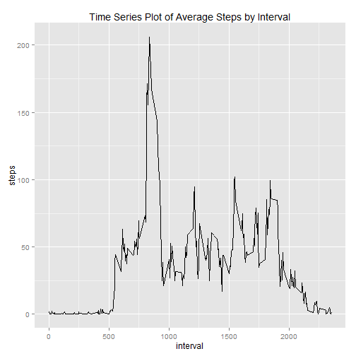
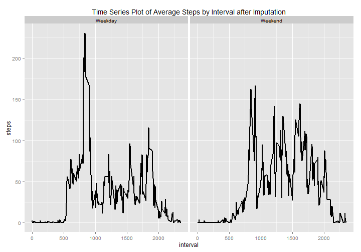

## Loading and preprocessing the data


```r
#Show any code that is needed to

#1. Load the data (i.e. read.csv())
	
	activitydata <- read.csv("activity.csv")

#2. Process/transform the data (if necessary) into a format suitable for your analysis
	
	activitydata$date <- as.Date(activitydata$date)
```


## What is mean total number of steps taken per day?


```r
#For this part of the assignment, you can ignore the missing values in the dataset.

#1. Calculate the total number of steps taken per day

	total.steps.by.day <- aggregate(x = activitydata$steps , by = list(activitydata$date), FUN = sum ,na.rm=TRUE)
	names(total.steps.by.day) <- c("date","steps")
	total.steps.by.day
```

```
##          date steps
## 1  2012-10-01     0
## 2  2012-10-02   126
## 3  2012-10-03 11352
## 4  2012-10-04 12116
## 5  2012-10-05 13294
## 6  2012-10-06 15420
## 7  2012-10-07 11015
## 8  2012-10-08     0
## 9  2012-10-09 12811
## 10 2012-10-10  9900
## 11 2012-10-11 10304
## 12 2012-10-12 17382
## 13 2012-10-13 12426
## 14 2012-10-14 15098
## 15 2012-10-15 10139
## 16 2012-10-16 15084
## 17 2012-10-17 13452
## 18 2012-10-18 10056
## 19 2012-10-19 11829
## 20 2012-10-20 10395
## 21 2012-10-21  8821
## 22 2012-10-22 13460
## 23 2012-10-23  8918
## 24 2012-10-24  8355
## 25 2012-10-25  2492
## 26 2012-10-26  6778
## 27 2012-10-27 10119
## 28 2012-10-28 11458
## 29 2012-10-29  5018
## 30 2012-10-30  9819
## 31 2012-10-31 15414
## 32 2012-11-01     0
## 33 2012-11-02 10600
## 34 2012-11-03 10571
## 35 2012-11-04     0
## 36 2012-11-05 10439
## 37 2012-11-06  8334
## 38 2012-11-07 12883
## 39 2012-11-08  3219
## 40 2012-11-09     0
## 41 2012-11-10     0
## 42 2012-11-11 12608
## 43 2012-11-12 10765
## 44 2012-11-13  7336
## 45 2012-11-14     0
## 46 2012-11-15    41
## 47 2012-11-16  5441
## 48 2012-11-17 14339
## 49 2012-11-18 15110
## 50 2012-11-19  8841
## 51 2012-11-20  4472
## 52 2012-11-21 12787
## 53 2012-11-22 20427
## 54 2012-11-23 21194
## 55 2012-11-24 14478
## 56 2012-11-25 11834
## 57 2012-11-26 11162
## 58 2012-11-27 13646
## 59 2012-11-28 10183
## 60 2012-11-29  7047
## 61 2012-11-30     0
```

```r
#2. If you do not understand the difference between a histogram and a barplot, research the difference between them. 
#Make a histogram of the total number of steps taken each day
	
	library(ggplot2)
	histplot <- ggplot(total.steps.by.day,aes(x = steps)) +
				ggtitle("Histogram of daily steps") +
				xlab("Steps (binwidth 2000)") +
				geom_histogram(binwidth = 2000)
	histplot
```

 

```r
#3. Calculate and report the mean and median of the total number of steps taken per day

	mean(total.steps.by.day$steps , na.rm = TRUE)
```

```
## [1] 9354.23
```

```r
	median(total.steps.by.day$steps , na.rm = TRUE)
```

```
## [1] 10395
```

## What is the average daily activity pattern?


```r
#1. Make a time series plot (i.e. type = "l") of the 5-minute interval (x-axis) and the average number of 
#steps taken, averaged across all days (y-axis)
	
	average.steps.by.interval  <- aggregate(x = activitydata$steps , by = list(activitydata$interval), FUN = mean ,na.rm=TRUE)
	names(average.steps.by.interval) <- c("interval","steps")

	avg.step.line <- ggplot(average.steps.by.interval,aes(interval,steps)) +
					 ggtitle("Time Series Plot of Average Steps by Interval") +
					 geom_line()
	avg.step.line  
```

 

```r
#2. Which 5-minute interval, on average across all the days in the dataset, contains the maximum number of steps?
	
	average.steps.by.interval[which.max(average.steps.by.interval$steps),c("interval")]
```

```
## [1] 835
```


## Imputing missing values


```r
#Note that there are a number of days/intervals where there are missing values (coded as NA). 
#The presence of missing days may introduce bias into some calculations or summaries of the data.

#1. Calculate and report the total number of missing values in the dataset (i.e. the total number of rows with NAs)

	nrow(activitydata[is.na(activitydata$steps),])
```

```
## [1] 2304
```

```r
#2. Devise a strategy for filling in all of the missing values in the dataset. 
#The strategy does not need to be sophisticated. For example, you could use the mean/median for that day, 
#or the mean for that 5-minute interval, etc.

	activitydata.imputed <- merge(x = activitydata, y = average.steps.by.interval, by = "interval", all.x = TRUE)
	activitydata.imputed[is.na(activitydata.imputed$steps.x),c("steps.x")] <- activitydata.imputed[is.na(activitydata.imputed$steps.x),c("steps.y")]


#3. Create a new dataset that is equal to the original dataset but with the missing data filled in.

	activitydata.imputed$date <- as.Date(activitydata.imputed$date)
	activitydata.imputed$date.x <- NULL
	activitydata.imputed$Group.1 <- NULL
	activitydata.imputed$steps <- activitydata.imputed$steps.x
	activitydata.imputed$steps.x <- NULL
	activitydata.imputed$steps.y <- NULL


#4. Make a histogram of the total number of steps taken each day and Calculate and report the mean and median total 
#number of steps taken per day. 

	total.steps.by.day <- aggregate(x = activitydata.imputed$steps , by = list(activitydata.imputed$date), FUN = sum ,na.rm=TRUE)
	names(total.steps.by.day) <- c("date","steps")
	histplot <- ggplot(total.steps.by.day,aes(x = steps)) +
				ggtitle("Histogram of daily steps after imputation") +
				xlab("Steps (binwidth 2000)") +
				geom_histogram(binwidth = 2000)
	histplot 
```

 

```r
	mean(total.steps.by.day$steps , na.rm = TRUE)
```

```
## [1] 10766.19
```

```r
	median(total.steps.by.day$steps , na.rm = TRUE)
```

```
## [1] 10766.19
```

```r
#Do these values differ from the estimates from the first part of the assignment? 

#	Yes

#What is the impact of imputing missing data on the estimates of the total daily number of steps?

#	The mean rises and the data became unreliable
```


## Are there differences in activity patterns between weekdays and weekends?


```r
#For this part the weekdays() function may be of some help here. Use the dataset with the filled-in missing values for this part.

#1. Create a new factor variable in the dataset with two levels – “weekday” and “weekend” indicating whether a given date is a weekday or weekend day.

	activitydata.imputed$weekday <- as.factor(ifelse(weekdays(activitydata.imputed$date) %in% c("Saturday","Sunday"), "Weekend", "Weekday")) 

	average.steps.by.interval.and.weekday  <- aggregate(x = activitydata.imputed$steps , 
														by = list(activitydata.imputed$interval,activitydata.imputed$weekday), FUN = mean ,na.rm=TRUE)
	names(average.steps.by.interval.and.weekday) <- c("interval","weekday","steps")


#2. Make a panel plot containing a time series plot (i.e. type = "l") of the 5-minute interval (x-axis) and the average number of steps taken, averaged across all weekday days or weekend days (y-axis). See the README file in the GitHub repository to see an example of what this plot should look like using simulated data.

	avg.step.line <- ggplot(average.steps.by.interval.and.weekday,aes(interval,steps)) +
					 ggtitle("Time Series Plot of Average Steps by Interval after Imputation") +
					 facet_grid(. ~ weekday) +
					 geom_line(size = 1)
	avg.step.line  
```

 

